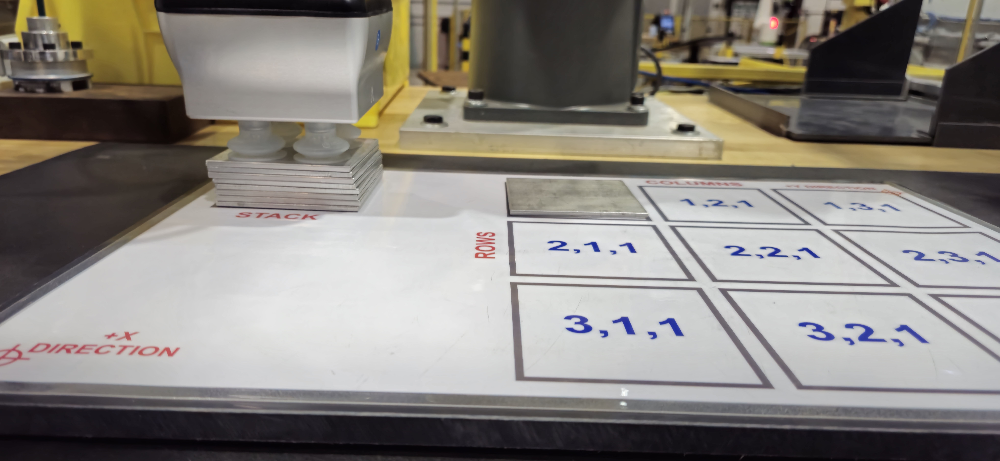
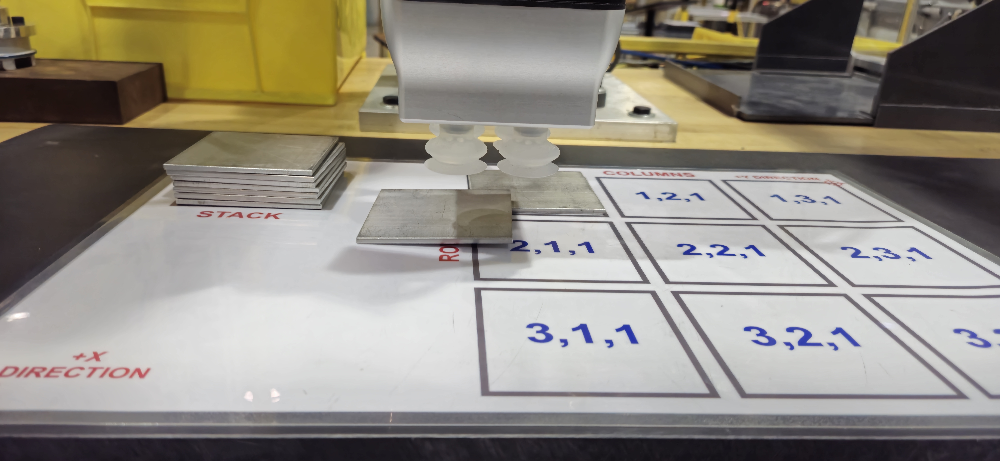
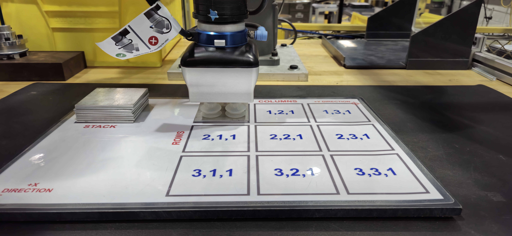

# Material Handling and Palletizing


## General Concept Map

By using a concept map, we can more easily understand the relationships between different ideas, concepts, and information, providing a structured visual overview that enhances organization. We can use it to simplify complex data, showing how each element connects which can aid us in planning and decision-making. It allows us to see the big picture of what we aim to accomplish within our program.


With our concept map we can see what we will be trying to accomplish in our Material Handling and Palletizing program in a neat, organized way.

## Programs and Program Flow

My Material Handling and Palletizing program set will include a couple different programs to handle our logic tasks, tests (via IF statements), and program calls.

### Main program - DEP_MAIN

The main program, DEP_MAIN, will handle the overall program logic and flow of the rest of the program.

The first thing we will do in our main program is explain all our data references in comment lines indicated by the ! at the begining of each line. We do this so that anyone looking at our program will understand all the different Inputs, Outputs, Registers, and any other relevent information that can assist with understanding what we are doing in our program.

```python
   1:  ! DATA REFERENCES ;
   2:  ! P[1] READY POSITION ;
   3:  ! TIMEOUT 2.5 SECONDS ;
   4:  ! -----INPUTS----- ;
   5:  ! DI[121] - BEGIN CYCLE ;
   6:  ! DI[122] - CONTINUE WITH CYCLE ;
   7:  ! DI[123] - RESTART RESOLVED ;
   8:  ! DI[124] - CONTINUE RESTORE DATA ;
   9:  ! DI[125] - REQUEST NEW PALLET ;
  10:  ! DI[126] - VACUUM RESET ;
  11:  ! -----OUTPUTS----- ;
  12:  ! DO[121] - READY TO BEGIN CYCLE ;
  13:  ! DO[122] - IN CYCLE ;
  14:  ! DO[123] - DEPALLETIZING ;
  15:  ! DO[124] - PALLETIZING ;
  16:  ! DO[125] - ABORTED ;
  17:  ! DO[126] - Not Used (Reserved) ;
  18:  ! DO[127] - VACUUM ON AT RESTART ;
  19:  ! -----PALLET REGISTERS----- ;
  20:  ! PL[1] - DEPALLETIZE ;
  21:  ! PL[2] - PALLETIZING ;
  22:  ! -----DATA REGISTERS----- ;
  23:  ! R[1] - DEPALLET COUNT REGISTER ;
  24:  ! R[2] - PALLET COUNT REGISTER ;
  25:  ! R[3] - ERROR CODE REGISTER ;
  26:  ! R[6] - RETRY COUNT FOR ERROR HA ;
  27:  ! -----STACK GROUP OUTPUT----- ;
  28:  ! GO[11] - PARTS ON STACK, 9 to 0 ;
  29:  ! -----PALLET GROUP OUTPUT----- ;
  30:  ! GO[12] - PARTS ON PALLET, 0 to 9 ;
  31:  ! -----ERROR GROUP OUTPUT----- ;
  32:  ! GO[13] - ERROR CODE ;
  33:  ! VALUE MEANING ;
  34:  ! 0 - No Error ;
  35:  ! 1 - (Reserved) ;
  36:  ! 2 - Part Pick-up Vacuum Failure ;
  37:  ! 3 - Vacuum Motion Error ;
  38:  ! 4 - (Reserved) ;
  39:  ! 5 - Part Drop-off Vacuum Failure ;
  40:  ! 6 - (Reserved) ;
  41:  ! 7 - Vacuum ON At Restart ;
  42:  ! --STACK RESTART GROUP INPUT-- ;
  43:  ! GI[11] - NUMBER OF PARTS AT STA ;
  44:  ! --PALLET RESTART GROUP INPUT-- ;
  45:  ! GI[12] - NUMBER OF PARTS AT STA ;
  46:  ! -----OnRobot FLAGS----- ;
  47:  ! F [14] - Channel A VACUUM ;
  48:  ! F [15] - Channel B VACUUM ;
  49:  ! ---OnRobot GROUP INPUTS--- ;
  50:  ! GI [47] - Channel A VACUUM FEED ;
  51:  ! GI [48] - Channel B VACUUM FEED ;
  52:  ! ---OnRobot GROUP OUTPUTS--- ;
  53:  ! GO [47] - Channel A VACUUM COMM ;
  54:  ! GO [48] - Channel B VACUUM COMM ;
  55:  ! LBL[1] Ready To Begin Cycle ;
  ```

  Now that we've provided the details on what inputs, outputs, flags, and registers our program will be using, we move on to our error handling section for when we recover from an error that required us to abort our program. In it, we use a series of IF statements to determine what steps we need to procede to after restarting from an Abort.

  ```python
  61:  LBL[111] ;
  62:  IF (GO[47]>5 OR GO[48]>5) THEN ;
  63:  DO[127]=ON ;
  64:  GO[13]=7 ;
  65:  UALM[6] ;
  66:  WAIT DI[126]=ON    ;
  67:  UALM[1] ;
  68:  DO[127]=OFF ;
  69:  GO[13]=0 ;
  70:  JMP LBL[111] ;
  71:  ENDIF ;
  ```

  Our first piece of error handing tests to see if ```GO[47]``` or ```GO[48]``` is on when we start our program. As we can see from our Data References section, these two Group Outputs ```(GO[])``` relate to the vacuum channels A and B. If they are detected as having a vacuum pressure of greater than 5 (meaning the vacuum is on), then it will turn ```DO[127] ON (VACUUM ON AT RESTART)``` and set User Alarm (UALM) to 6 to alert the controller that the program detected the vacuum as being on during a restart. It will then give the user a chance to turn off the vacuum and tap ```DI[126]``` to continue the program. When the controller presses ```DI[126]```, it will reset ```DO[127]``` to OFF and clear the ```UALM```. It will then loop back to ```LBL[111]``` to confirm that both vacuum's are indeed OFF, and if they are, skip the IF statement and procede with the program.

  ```python
  76:  IF (R[3:ERROR NUMBER]>0) THEN ;
  77:  GO[13]=R[3:ERROR NUMBER] ;
  78:  ENDIF ;
  ```

  ```R[3]``` is our register that stores our error code in numeral form when our logic in our program detects an error or problem that we have planned for. This register remains intact even during a complete shutdown-tagout situation. If ```R[3]``` is greater than 0, it means, in our program, that the robot was restarted due to an error and it sets ```GO[13]``` to that error in case our HDMI screen was reset or changed since the initial error. This redundancy allows the controller to know exactly what error caused our abort/restart event.

  ```python
  89:  IF (GO[13]=2) THEN ;
  90:  R[3:ERROR NUMBER]=0    ;
  91:  GO[13]=R[3:ERROR NUMBER] ;
  92:  DO[125]=OFF ;
  93:  LBL[777] ;
  94:  IF DI[125]=ON,JMP LBL[1] ;
  95:  IF DI[122]=ON,JMP LBL[2] ;
  96:  JMP LBL[777] ;
  97:  ENDIF ;
  ```

  In this section of our error handling, we check to see ```IF GO[13]=2``` and if it does, goes through our handling for it. According to our Data References, we can easily see that an error code of 2 indicates a Part Pick-up Vacuum Failure, which means the vacuum cups failed to turn on at our stack during our Depalletizing program - ```DEP_DEPALLET```

  Here, we can see the vacuum fails to turn on when at the plate on the pallet. Lets break down what happens for this error to trigger:

  ```python
   #Our depalletizing cycle begins
   4:  LBL[1] ;
   5:  PALLETIZING-B_1 ;
   6:J PAL_1[A_1] 70% CNT50    ;
   7:L PAL_1[BTM] 100mm/sec FINE    ;
   8:  LBL[2] ;
   9:  CALL GRASP(10,10) ; #The program GRASP is called to turn vacuum on
  10:  CALL CHECK_VACUUM(10,10) ; #The program CHECK_VACUUM is called to check pressure and set Flags
  11:  WAIT (F[14]=ON AND F[15]=ON) TIMEOUT,LBL[5] ; #We confirm F[14] and F[15] are ON, if not within TIMEOUT, jumps to LBL[5]
  12:  SKIP CONDITION GI[47]<5 OR GI[48]<5    ; #Skip Condition sets the skip condition for our next line
  13:L PAL_1[R_1] 300mm/sec CNT50 Skip,LBL[3]    ; #Moves to retract positions and parses the skip condition, if FALSE, goes to LBL[3]
  14:  JMP LBL[6] ; #If our above skip condition was TRUE, it would go to this line and then jump to LBL[6]
  15:  LBL[3] ;
  16:  PALLETIZING-END_1 ;
  17:  JMP LBL[999] ;

  ...

  21:  LBL[5] ; #Our retry handling for if the vacuum fails to turn on
  22:  UALM[1] ;
  23:  R[6:RETRY COUNT]=R[6:RETRY COUNT]+1    ;
  24:  IF R[6:RETRY COUNT]>=4,JMP LBL[666] ;
  25:  JMP LBL[2] ;

  ...

  29:  LBL[6] ; #Our retry handling for if the vacuum detects no suction pressure at our retract point
  30:  UALM[1] ;
  31:  R[6:RETRY COUNT]=R[6:RETRY COUNT]+1    ;
  32:  IF R[6:RETRY COUNT]>=4,JMP LBL[666] ;
  33:  CALL RELEASE(0,0) ;
  34:  JMP LBL[1] ;

  ...

  38:  LBL[666] ; #Our handling for when we exceed our set retry limit, in our case, 3 retries
  39:  R[6:RETRY COUNT]=0    ;
  40:  CALL RELEASE(0,0) ;
  41:  DO[122]=OFF ;
  42:  DO[123]=OFF ;
  43:  DO[125]=ON ;
  44:  R[3:Error Code]=2    ;
  45:  GO[13]=R[3:Error Code] ;
  46:  UALM[2] ;
  47:  ABORT ;

  ```


## Error Handling for Part Pick-up Vacuum Failure (Error Code 2)



In the `DEP_DEPALLET` program, the robot attempts to pick up a part from the stack using vacuum suction. It checks if both vacuum channels (A and B) are successfully activated by waiting for flags `F[14]` and `F[15]` to turn ON. If the vacuum fails to activate within the specified timeout period, the program jumps to `LBL[5]` to handle the retry logic.

### Retry Mechanism

At `LBL[5]`, the program triggers User Alarm 1 (`UALM[1]`) to alert the operator of the issue. It then increments the retry count stored in register `R[6:RETRY COUNT]`. If the retry count is less than 4, the program jumps back to `LBL[2]` to attempt the pickup again. This allows the robot to retry the pickup operation up to three times (since the count starts at 0).

### Exceeding Retry Limit

If the retry count reaches 4, indicating that the vacuum has failed to activate after three attempts, the program jumps to `LBL[666]`. Here, it performs the following actions:

- Resets the retry count to 0 (`R[6:RETRY COUNT]=0`).
- Calls the `RELEASE` program to turn off the vacuum.
- Turns off `DO[122]` (IN CYCLE) and `DO[123]` (DEPALLETIZING) to indicate that the cycle has stopped.
- Turns on `DO[125]` (ABORTED) to signal that the program has aborted due to an error.
- Sets register `R[3:Error Code]` to 2, indicating a Part Pick-up Vacuum Failure.
- Outputs the error code to `GO[13]` for external monitoring or logging.
- Triggers User Alarm 2 (`UALM[2]`) to notify the operator of the failure.
- Aborts the program.

### Recovery in DEP_MAIN

When the program is restarted after an abort, the `DEP_MAIN` program checks the error code in `GO[13]`. If `GO[13]` is 2, it performs the following recovery steps:

- Resets register `R[3:Error Code]` and `GO[13]` to 0 to clear the error code.
- Turns off `DO[125]` (ABORTED).
- Enters a waiting loop at `LBL[777]`, where it waits for input from the operator:
  - If `DI[125]` (REQUEST NEW PALLET) is turned ON, the program jumps to `LBL[1]` to reset and start a new cycle with a new pallet.
  - If `DI[122]` (CONTINUE WITH CYCLE) is turned ON, the program jumps to `LBL[2]` to continue the cycle from the depalletizing step.

This allows the operator to decide whether to continue with the current cycle or to request a new pallet, depending on the situation.


## Error Handling for Vacuum Motion Error (Error Code 3)



The **Vacuum Motion Error (Error Code 3)** occurs when the vacuum pressure drops below a specified threshold during the robot's motion, indicating a potential loss of suction or a dropped part. This error is detected by the condition monitoring program `DEP_CONDMON`, which runs in the background and triggers the error-handling program `DEP_ACTPROG` when the issue is identified.

### Detection via Condition Monitoring

The error is detected by `DEP_CONDMON`, which is activated in the main program `DEP_MAIN` before the palletizing step. In `DEP_CONDMON`, the system continuously monitors the vacuum pressure on channels A and B using group inputs `GI[47]` and `GI[48]`. If the pressure on either channel drops below 50, `DEP_ACTPROG` is called to handle the error.

### Handling in DEP_ACTPROG

When `DEP_ACTPROG` is triggered due to a **Vacuum Motion Error**, it executes the following actions to halt the operation and notify the operator:

- Turns off `DO[122]` (IN CYCLE) and `DO[124]` (PALLETIZING) to stop the current cycle.
- Turns on `DO[125]` (ABORTED) to indicate the program has aborted due to an error.
- Sets the error code register `R[3:Error Code]` to 3 and outputs it to `GO[13]` for external monitoring or logging.
- Triggers User Alarm 3 (`UALM[3]`) to alert the operator of the failure.
- Waits for 2 seconds before aborting the program to allow the operator to acknowledge the alarm.

### Recovery in DEP_MAIN

After the program aborts and the operator resolves the issue (e.g., by clearing a dropped part), restarting `DEP_MAIN` initiates the recovery process for **Error Code 3**. The system checks the error code in `GO[13]` and performs the following steps if it is 3:

- Resets `R[3:Error Code]` and `GO[13]` to 0 to clear the error code.
- Turns off `DO[125]` (ABORTED) to indicate the system is no longer in an aborted state.
- Waits for `DI[123]` (RESTART RESOLVED) to be turned ON, confirming the operator has addressed the issue.
- Updates the pallet count register `R[2:PALLET COUNT]` with the current number of parts on the pallet from `GI[12]`.
- If the pallet is full (`R[2:PALLET COUNT]=9`), jumps to `LBL[1]` to start a new cycle.
- Otherwise, calls `DEP_LOOKTBL` to set the pallet register `PL[2]` to the correct position based on the current count.
- Enters a waiting loop at `LBL[778]`, where it waits for operator input:
  - If `DI[125]` (REQUEST NEW PALLET) is turned ON, jumps to `LBL[1]` to reset and start a new cycle.
  - If `DI[122]` (CONTINUE WITH CYCLE) is turned ON, jumps to `LBL[2]` to continue the cycle from the depalletizing step.

This recovery process ensures the system resumes operation correctly, taking into account the current state of the pallet and the operator's decision.


## Error Handling for Part Drop-off Vacuum Failure (Error Code 5)



In the `DEP_PALLET` program, the robot attempts to place a part onto the pallet by releasing it from the vacuum gripper. After moving to the drop-off position, it calls the `RELEASE` program to turn off the vacuum and waits for flags `F[14]` and `F[15]` to turn OFF, confirming the part has been released. If the vacuum fails to deactivate within the specified timeout period, the program jumps to `LBL[5]` to handle the retry logic, indicating a **Part Drop-off Vacuum Failure (Error Code 5)**.

### Retry Mechanism

At `LBL[5]`, the program triggers User Alarm 4 (`UALM[4]`) to alert the operator of the issue. It then increments the **retry counter** stored in register `R[6:RETRY COUNT]`. If the retry counter is less than 4, the program jumps back to `LBL[2]` to attempt the release again. This allows the robot to retry the drop-off operation up to three times (since the count starts at 0).

### Exceeding Retry Limit

If the **retry counter** reaches 4, indicating that the vacuum has failed to turn off after three attempts, the program jumps to `LBL[666]`. Here, it performs the following actions:

- Resets the **retry counter** to 0 (`R[6:RETRY COUNT]=0`).
- Calls the `RELEASE` program to ensure the vacuum is off.
- Turns off `DO[122]` (IN CYCLE) and `DO[124]` (PALLETIZING) to indicate that the cycle has stopped.
- Turns on `DO[125]` (ABORTED) to signal that the program has aborted due to an error.
- Sets register `R[3:Error Code]` to 5, indicating a Part Drop-off Vacuum Failure.
- Outputs the error code to `GO[13]` for external monitoring or logging.
- Triggers User Alarm 5 (`UALM[5]`) to notify the operator of the failure.
- Aborts the program.

### Recovery in DEP_MAIN

When the program is restarted after an abort, the `DEP_MAIN` program checks the error code in `GO[13]`. If `GO[13]` is 5, it performs the following recovery steps:

- Resets register `R[3:Error Code]` and `GO[13]` to 0 to clear the error code.
- Turns off `DO[125]` (ABORTED).
- Waits for `DI[123]` (RESTART RESOLVED) to be turned ON, indicating that the operator has resolved the issue.
- Updates the pallet count register `R[2:PALLET COUNT]` with the current number of parts on the pallet from `GI[12]`.
- If the pallet is full (`R[2:PALLET COUNT]=9`), jumps to `LBL[1]` to start a new cycle.
- Otherwise, calls `DEP_LOOKTBL` to set the pallet register `PL[2]` to the correct position based on the current count.
- Enters a waiting loop at `LBL[779]`, where it waits for input from the operator:
  - If `DI[125]` (REQUEST NEW PALLET) is turned ON, jumps to `LBL[1]` to reset and start a new cycle.
  - If `DI[122]` (CONTINUE WITH CYCLE) is turned ON, jumps to `LBL[2]` to continue the cycle from the depalletizing step.

This recovery process ensures the system resumes operation correctly, accounting for the pallet’s state and the operator’s input.


## Error Handling for Vacuum ON At Restart (Error Code 7)

  

The **Vacuum ON At Restart (Error Code 7)** occurs when the vacuum is unexpectedly ON at the beginning of the `DEP_MAIN` program, before the main cycle starts. This could indicate a safety or operational issue, such as a stuck valve or a part still attached to the gripper from a previous cycle.

### Detection and Handling

At the start of `DEP_MAIN`, the program checks the vacuum status by examining group outputs `GO[47]` and `GO[48]`, which represent the vacuum pressure on channels A and B. If either `GO[47]` or `GO[48]` is greater than 5, indicating the vacuum is ON, the program performs the following actions:

- Turns on `DO[127]` (VACUUM ON AT RESTART) to signal the issue.
- Sets the error code register `R[3:ERROR NUMBER]` to 7.
- Outputs the error code to `GO[13]` for external monitoring or logging.
- Triggers User Alarm 6 (`UALM[6]`) to alert the operator of the issue.
- Waits for `DI[126]` (VACUUM RESET) to be turned ON, indicating that the operator has manually resolved the vacuum issue (e.g., turned off the vacuum or removed a stuck part).
- Once `DI[126]` is ON, resets `DO[127]` to OFF and clears the error code by setting `GO[13]` to 0.
- Loops back to recheck the vacuum status to ensure it is OFF before proceeding.

*Note*: Unlike other errors, this does not involve a retry mechanism or an abort to `LBL[666]`, as it occurs before the main cycle begins and requires immediate operator intervention.

### Recovery in DEP_MAIN

Since this error is addressed at the start of `DEP_MAIN`, the recovery is integrated into the handling process:

- After the operator resets the vacuum and confirms via `DI[126]`, the program clears the error and proceeds with the normal cycle initialization.
- If the vacuum remains ON after the reset attempt, the program loops back, re-triggers the alarm, and waits again until the issue is fully resolved.

This ensures the program only continues once the vacuum is confirmed OFF, preventing potential hazards or errors in the subsequent cycle.