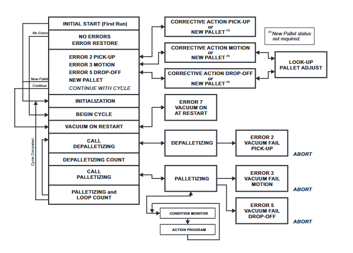

# Material Handling and Palletizing

## General Concept Map

By using a concept map, we can more easily understand the relationships between different ideas, concepts, and information, providing a structured visual overview that enhances organization. We can use it to simplify complex data, showing how each element connects which can aid us in planning and decision-making. It allows us to see the big picture of what we aim to accomplish within our program.



With our concept map we can see what we will be trying to accomplish in our Material Handling and Palletizing program in a neat, organized way.

## Programs and Program Flow

My Material Handling and Palletizing program set will include a couple different programs to handle our logic tasks, tests (via IF statements), and program calls.

### Main program - DEP_MAIN

The main program, DEP_MAIN, will handle the overall program logic and flow of the rest of the program.

The first thing we will do in our main program is explain all our data references. We do this so that anyone looking at our program will understand all the different Inputs, Outputs, Registers, and any other relevent information that can assist with understanding what we are doing in our program.

```python
   1:  ! DATA REFERENCES ;
   2:  ! P[1] READY POSITION ;
   3:  ! TIMEOUT 2.5 SECONDS ;
   4:  ! -----INPUTS----- ;
   5:  ! DI[121] - BEGIN CYCLE ;
   6:  ! DI[122] - CONTINUE WITH CYCLE ;
   7:  ! DI[123] - RESTART RESOLVED ;
   8:  ! DI[124] - CONTINUE RESTORE DATA ;
   9:  ! DI[125] - REQUEST NEW PALLET ;
  10:  ! DI[126] - VACUUM RESET ;
  11:  ! -----OUTPUTS----- ;
  12:  ! DO[121] - READY TO BEGIN CYCLE ;
  13:  ! DO[122] - IN CYCLE ;
  14:  ! DO[123] - DEPALLETIZING ;
  15:  ! DO[124] - PALLETIZING ;
  16:  ! DO[125] - ABORTED ;
  17:  ! DO[126] - Not Used (Reserved) ;
  18:  ! DO[127] - VACUUM ON AT RESTART ;
  19:  ! -----PALLET REGISTERS----- ;
  20:  ! PL[1] - DEPALLETIZE ;
  21:  ! PL[2] - PALLETIZING ;
  22:  ! -----DATA REGISTERS----- ;
  23:  ! R[1] - DEPALLET COUNT REGISTER ;
  24:  ! R[2] - PALLET COUNT REGISTER ;
  25:  ! R[3] - ERROR CODE REGISTER ;
  26:  ! R[6] - RETRY COUNT FOR ERROR HA ;
  27:  ! -----STACK GROUP OUTPUT----- ;
  28:  ! GO[11] - PARTS ON STACK, 9 to 0 ;
  29:  ! -----PALLET GROUP OUTPUT----- ;
  30:  ! GO[12] - PARTS ON PALLET, 0 to 9 ;
  31:  ! -----ERROR GROUP OUTPUT----- ;
  32:  ! GO[13] - ERROR CODE ;
  33:  ! VALUE MEANING ;
  34:  ! 0 - No Error ;
  35:  ! 1 - (Reserved) ;
  36:  ! 2 - Part Pick-up Vacuum Failure ;
  37:  ! 3 - Vacuum Motion Error ;
  38:  ! 4 - (Reserved) ;
  39:  ! 5 - Part Drop-off Vacuum Failure ;
  40:  ! 6 - (Reserved) ;
  41:  ! 7 - Vacuum ON At Restart ;
  42:  ! --STACK RESTART GROUP INPUT-- ;
  43:  ! GI[11] - NUMBER OF PARTS AT STA ;
  44:  ! --PALLET RESTART GROUP INPUT-- ;
  45:  ! GI[12] - NUMBER OF PARTS AT STA ;
  46:  ! -----OnRobot FLAGS----- ;
  47:  ! F [14] - Channel A VACUUM ;
  48:  ! F [15] - Channel B VACUUM ;
  49:  ! ---OnRobot GROUP INPUTS--- ;
  50:  ! GI [47] - Channel A VACUUM FEED ;
  51:  ! GI [48] - Channel B VACUUM FEED ;
  52:  ! ---OnRobot GROUP OUTPUTS--- ;
  53:  ! GO [47] - Channel A VACUUM COMM ;
  54:  ! GO [48] - Channel B VACUUM COMM ;
  55:  ! LBL[1] Ready To Begin Cycle ;
  ```

  Now that we've provided the details on what inputs, outputs, and registers our program will be using, we move on to our error handling section for when we recover from an error that required us to abort our program. In it, we use a series of IF statements to determine what steps we need to procede to after restarting from an Abort.

  ```python
  61:  LBL[111] ;
  62:  IF (GI[47]>1 OR GI[48]>1) THEN ;
  63:  DO[127]=ON ;
  64:  R[3:ERROR NUMBER]=6    ;
  65:  GO[13]=R[3:ERROR NUMBER] ;
  66:  UALM[6] ;
  67:  WAIT DI[126]=ON    ;
  68:  UALM[...] ;
  69:  DO[127]=OFF ;
  70:  R[3:ERROR NUMBER]=0    ;
  71:  GO[13]=R[3:ERROR NUMBER] ;
  72:  JMP LBL[111] ;
  73:  ENDIF ;
  ```

  Our first piece of error handing tests to see if GI[47] or GI[48] is on when we start our program. As we can see from our Data References section, these two Group Inputs (GI[]) relate to the vacuum channels A and B. If they are detected as having a vacuum pressure of greater than 1 (meaning the vacuum is on), then it will turn DO[127] ON (VACUUM ON AT RESTART) and set User Alarm (UALM) to 6 to alert the controller that the program detected the vacuum as being on during a restart. It will then give the user a chance to turn off the vacuum and tap DI[126] to continue the program. When the controller presses DI126, it will reset DO[127] to OFF and clear the UALM. It will then loop back to LBL[111] to confirm that both vacuum's are indeed OFF, and if they are, skip the IF statement and procede with the program.