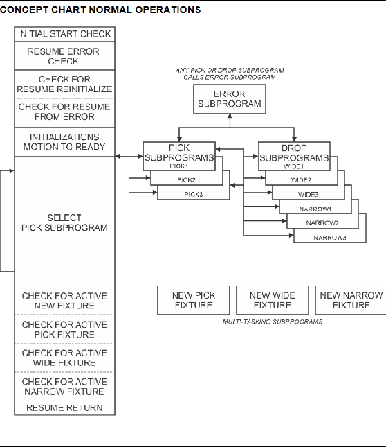
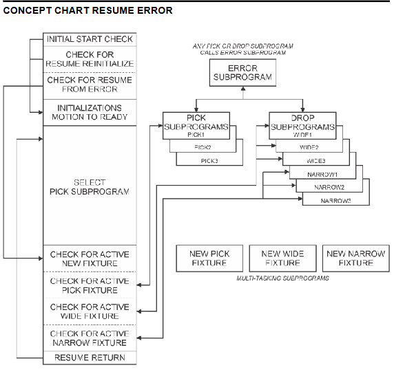

# Material Handling and Sorting


## General Concept Map



With a concept map, we can better grasp how ideas, concepts, and details interlink, offering a clear visual layout that boosts organization. It helps streamline complex information, revealing connections between components to support planning and choices. This gives us a broad view of our program’s goals and objectives.

For our Material Handling and Sorting program, we have two concept maps - Normal Operations and Resume Error.

## Programs and Program Flow

In my Material Handling and Sorting program stack a separate subprogram is used for each pickup and drop-off action to handle the specific logic and error conditions for each part and fixture location. This modular approach allows the main program to use a "Select - Case" structure to call the appropriate subprogram based on the part count and fixture state, ensuring tailored handling of wide parts, narrow parts, or no-part scenarios, as well as specific error checks (e.g., open, close, release failures) for each action.

### Main program - DEP_MHDSMAIN

Initially, our main program will detail all data references using comment lines marked with ! at the start of each. This ensures anyone reviewing the program grasps the various Inputs, Outputs, Registers, and other pertinent details that help clarify what we’re accomplishing within our program.

```python
: !****************************** ;
: !	DATA REFERENCES ;
: !****************************** ;
: !	INPUTS ;
: !	DI[121] - RESUME FROM ERROR ;
: !	DI[122] - RESUME REINITIALIZE ;
: !	DI[123] - NEW PICK FIXTURE RECI ;
: !	DI[124] - NEW WIDE FIXTURE RECI ;
: !	DI[125] - NEW NARROW FIXTURE RE ;
: !	DI[126] - ERROR RESET ;
: ! ;
: ! ;
: !	OUTPUTS ;
: !	DO[121] - IN CYCLE ;
: !	DO[122] - MAINT ;
: ! ;
: ! ;
: !	MULTI-TASKING FLAGS ;
: !	F[1] - SYNC PICK FIXTURE ;
: !	F[2] - SYNC WIDE FIXTURE ;
: !	F[3] - SYNC NARROW FIXTURE ;
: ! ;
: ! ;
: !	PART ATTEMPT\DETECTED GROUP OUT ;
: !	GO[11] VALUES ;
: !	0 - Not Moving Part ;
: !	1 - Wide Part Attempt/Detected ;
: !	2 - Narrow Part Attempt/Detecte ;
: !	3 - No Part Detected ;
: ! ;
: ! ;
: !	ERROR CODE GROUP OUTPUT ;
: !	GO[12]	VALUES ;
: !	0 - No Error ;
: !	1 - Open Fail ;
: !	2 - Close Fail ;
: !	3 - Release Fail ;
: ! ;
: ! ;
: !	GO[13] VALUES ;
: !	0 - No Active Pallet Request ;
: !	1 - Fixture Part Pickup Request ;
: !	2 - Fixture Wide Part Request ;
: !	3 - Fixture Narrow Part Request ;
: ! ;
: ! ;
: !	FIXTURE COUNT GROUP OUTPUTS ;
: !	GO[14] - PICK FIXTURE ;
: !	GO[15] - WIDE FIXTURE ;
: !	GO[16] - NARROW FIXTURE ;
: ! ;
: ! ;
: !	REGISTERS ;
: !	R[1] - PICK PART FIXTURE COUNT ;
: !	R[2] - WIDE PART FIXTURE COUNT ;
: !	R[3] - NARROW PART FIXTURE COUN ;
: !	R[4] - INITIAL START ;
: ! ;
: ! ;
: !	POSITIONS ;
: !	P[1] READY ;
: !	P[2] STAGE ;
: ! ;
: ! ;	LBL[2] OPEN FAIL ERROR CHECK ;
: !	LBL[111] INITIALIZE ;
: !	LBL[777] RESTART INPUT LOOP ;
: !	LBL[999] END OF PROGRAM ;
: ! ;
: ! ;
: !****************************** ;
: !	END DATA REFERENCES ;
: !****************************** ;
```

## Overview of Error Handling


The error handling sequence is triggered when the gripper fails, setting the Error Code Group Output (GO[12]) to 1 (Open Fail), 2 (Close Fail), or 3 (Release Fail). On restart, if DI[121] (Resume from Error) is ON, the Main program waits for this input, then checks GO[12] for the error type. For Open Fail in a Pick subprogram, it branches before the Open Gripper call; for Close Fail, it uses GO[11] (1 for Wide, 2 for Narrow) to branch before the Wide or Narrow Close Gripper call; for Release Fail in a Drop subprogram, it branches before the Open Gripper call. The subprogram calls the Error Handling subprogram, which turns OFF DO[121] (In Cycle), turns ON DO[122] (MAINT), pauses, and waits for DI[126] (Error Reset) to reset GO[12] to 0 and resume. If DI[122] (Resume Reinitialize) is ON, the program branches to the Initialization subprogram, resetting all outputs, flags, and registers (e.g., R[1] to 3, R[2] and R[3] to 0), then restarts from the READY position and first Pick subprogram call.

### Open Fail (GO[12] = 1) Handling


The Open Fail error, indicated by setting GO[12] to 1, occurs when the gripper fails to open properly before attempting to pick up a part in a Pick subprogram. This typically happens if the gripper’s feedback flag (F[11]) remains OFF after the RELEASE command, signaling that the gripper did not reach the required open distance (e.g., 95 mm). When this error is detected, the subprogram immediately sets GO[12] to 1 and calls the Error Handling subprogram, which halts the robot by turning OFF the In Cycle output (DO[121]), turns ON the Maintenance output (DO[122]), and pauses execution. On restart, if Resume from Error is selected via DI[121], the program checks GO[12], identifies the Open Fail, and branches back to the Pick subprogram just before the Open Gripper call, allowing a reattempt. After the Error Reset input (DI[126]) is received, GO[12] is cleared to 0, DO[122] is turned OFF, DO[121] is turned ON, and the subprogram resumes, ensuring the gripper opens correctly before proceeding to grasp the part.

### Close Fail (GO[12] = 2) Handling


The Close Fail error, marked by GO[12] set to 2, arises during a Pick subprogram when the gripper fails to close adequately to grasp a part, either Wide or Narrow, after the GRASP command. This is detected when the gripper closed flag (F[12]) stays OFF, indicating the gripper didn’t reach the commanded distance (e.g., 50 mm for Wide, 35 mm for Narrow), or the force flag (F[13]) doesn’t activate. Upon detection, the subprogram assigns GO[12] to 2 and invokes the Error Handling subprogram, which disables DO[121] (In Cycle), enables DO[122] (Maintenance), and pauses the system. On restart with DI[121] (Resume from Error) activated, the program uses GO[12] and GO[11] (1 for Wide, 2 for Narrow) to determine the part type, branching to the Pick subprogram before the specific Close Gripper call for that part. After DI[126] (Error Reset) is triggered, GO[12] resets to 0, DO[122] turns OFF, DO[121] turns ON, and execution resumes, allowing the gripper to retry closing and proceed with part detection and pickup.

### Release Fail (GO[12] = 3) Handling


The Release Fail error, denoted by GO[12] equal to 3, occurs in a Drop subprogram when the gripper fails to open and release a part onto the Wide or Narrow fixture, flagged by F[11] remaining OFF after the RELEASE command. This failure sets GO[12] to 3, prompting the subprogram to call the Error Handling subprogram, which turns OFF DO[121] (In Cycle), turns ON DO[122] (Maintenance), and pauses operation. When restarted with DI[121] (Resume from Error), the program examines GO[12] to confirm the Release Fail and branches to the Drop subprogram just before the Open Gripper call, using the fixture context (e.g., Wide or Narrow from prior GO[11] settings). Following the Error Reset input (DI[126]), GO[12] is reset to 0, DO[122] is deactivated, DO[121] is reactivated, and the subprogram continues, ensuring the gripper opens to release the part, updates the fixture count, and returns to the main sequence. This process ensures the part is properly dropped before moving to the next task.

## Pallet Request Sequences

### Waiting for Replacement of Pick Fixture Pallet


The process for waiting for a replacement Pick Fixture pallet begins when the Pick Fixture is depleted, indicated by the Pick Fixture Count Register (R[1]) reaching zero after decrementing from three as all parts are removed. The main program detects this via the Fixture Count Group Output (GO[14]) and sets the New Fixture Request Group Output (GO[13]) to 1, signaling a Fixture Part Pickup Request. The New Pick Fixture subprogram is then triggered as a multi-tasking task, setting the Sync Pick Fixture Flag (F[1]) to ON, which pauses the Pick subprogram at the Pick Approach position until the replacement is complete. The robot waits for the New Pick Fixture Received input (DI[123]) to turn ON, confirming the fixture is replaced, at which point GO[13] resets to 0 (No Active Pallet Request), R[1] and GO[14] are reset to 3, and F[1] turns OFF. This releases the Pick subprogram to resume, allowing the robot to proceed with picking parts from the refreshed fixture.

### Waiting for Replacement of Wide Fixture Pallet


The replacement process for the Wide Fixture pallet initiates when the Wide Fixture Count Register (R[2]) reaches three, signaling the fixture is full, tracked by the Fixture Count Group Output (GO[15]). The main program responds by setting GO[13] to 2 (Fixture Wide Part Request), launching the New Wide Fixture subprogram as an asynchronous multi-tasking operation. This subprogram activates the Sync Wide Fixture Flag (F[2]) to ON, halting the Drop Wide subprogram at the Drop Clearance position until the pallet swap is finished. The system then waits for the New Wide Fixture Received input (DI[124]) to activate, indicating the full fixture has been swapped with an empty one, prompting GO[13] to reset to 0, R[2] and GO[15] to reset to 0, and F[2] to turn OFF. Once cleared, the Drop Wide subprogram resumes, enabling the robot to continue placing Wide parts onto the newly emptied fixture.

### Waiting for Replacement of Narrow Fixture Pallet


The Narrow Fixture pallet replacement starts when the Narrow Fixture Count Register (R[3]) hits three, indicating a full fixture, as reflected by the Fixture Count Group Output (GO[16]). The main program sets GO[13] to 3 (Fixture Narrow Part Request), initiating the New Narrow Fixture subprogram in a multi-tasking mode, which turns the Sync Narrow Fixture Flag (F[3]) ON, pausing the Drop Narrow subprogram at the Drop Clearance position. The robot remains in this state until the New Narrow Fixture Received input (DI[125]) is received, confirming the replacement of the full fixture with an empty one, after which GO[13] returns to 0, R[3] and GO[16] are reset to 0, and F[3] switches OFF. This allows the Drop Narrow subprogram to proceed, permitting the robot to resume dropping Narrow parts onto the now-empty Narrow Fixture pallet.