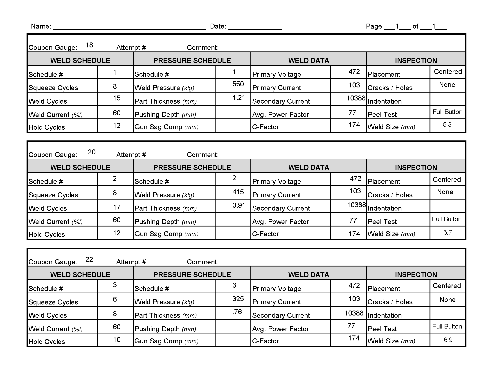

# RSW (SPOT) Welding Fixture

## Spot Weld Data Sheet

### Overview
The document is divided into three sections, each corresponding to a different weld schedule (labeled 1, 2, and 3). Each section includes four categories: Weld Schedule, Pressure Schedule, Weld Data, and Post Weld Inspection.

The sections below will go into more depth of each weld, including images of the welds and suggestions for improvements.

## 18 Gauage / Weld Schedule 1

- **Weld Schedule**
  - Schedule #: 1
  - Squeeze Cycles: 8 (cycles before welding begins to ensure proper electrode contact)
  - Weld Cycles: 15 (duration of the welding current application)
  - Weld Current (%): 60 (percentage of maximum current capacity)
  - Hold Cycles: 12 (cycles after welding to hold the electrodes in place for cooling)

- **Pressure Schedule**
  - Schedule #: 1
  - Weld Pressure (kfg): 550 (pressure applied by electrodes, in kilogram-force)
  - Part Thickness (mm): 1.21 (thickness of the material being welded, corresponding to 18 gauge)

- **Weld Data**
  - Primary Voltage: 472 (voltage applied to the welding transformer)
  - Primary Current: 103 (current through the primary circuit)
  - Secondary Current: 10388 (current through the secondary circuit, i.e., the weld)
  - Average Power Factor: 77
  - C-Factor: 174

- **Inspection**
  - Placement: Centered (position of the weld on the material)
  - Cracks/Holes: None (no visible defects in the weld)
  - Peel Test: Full Button (indicating a successful weld where the nugget pulls a full button of material during testing)
  - Weld Size (mm): 5.3 (diameter of the weld nugget)

**Suggestions for Improvement**  
- The weld size (5.3 mm) is within the typical recommended range of approximately 4.4 mm to 5.5 mm for 18 gauge (1.21 mm) material. No major adjustments are necessary. If further optimization is desired, minor tweaks to cycles or current could be tested, but the current parameters are acceptable in typical industry settings.

## 20 Gauge

- **Weld Schedule**
  - Schedule #: 2
  - Squeeze Cycles: 8
  - Weld Cycles: 17
  - Weld Current (%): 60
  - Hold Cycles: 12

- **Pressure Schedule**
  - Schedule #: 2
  - Weld Pressure (kfg): 415
  - Part Thickness (mm): 0.91 (corresponding to 20 gauge)

- **Weld Data**
  - Primary Voltage: 472
  - Primary Current: 103
  - Secondary Current: 10388
  - Average Power Factor: 77
  - C-Factor: 174

- **Inspection**
  - Placement: Centered
  - Cracks/Holes: None
  - Peel Test: Full Button
  - Weld Size (mm): 5.7

**Suggestions for Improvement**  
- The weld size (5.7 mm) exceeds the typical range of approximately 3.8 mm to 4.75 mm for 20 gauge (0.91 mm) material. If a smaller weld size is desired, I would consider reducing weld cycles from 17 to 14-15 or lowering the weld current from 60% to 55%.

## 22 Gauge

- **Weld Schedule**
  - Schedule #: 3
  - Squeeze Cycles: 6
  - Weld Cycles: 8
  - Weld Current (%): 60
  - Hold Cycles: 10

- **Pressure Schedule**
  - Schedule #: 3
  - Weld Pressure (kfg): 325
  - Part Thickness (mm): 0.76 (corresponding to 22 gauge)

- **Weld Data**
  - Primary Voltage: 472
  - Primary Current: 103
  - Secondary Current: 10388
  - Average Power Factor: 77
  - C-Factor: 174

- **Inspection**
  - Placement: Centered
  - Cracks/Holes: None
  - Peel Test: Full Button
  - Weld Size (mm): 6.9

**Suggestions for Improvement**  
- The weld size (6.9 mm) is significantly larger than the typical range of approximately 3.5 mm to 4.35 mm for 22 gauge (0.76 mm) material. If a smaller weld size is required, I would consider reducing weld cycles from 8 to 6-7, lowering the weld current to 50% or less, or slightly increasing weld pressure.

## Closing Statement
This project successfully demonstrated the effectiveness of tailored resistance spot welding schedules for materials of varying thicknesses—specifically 18 gauge (1.21 mm), 20 gauge (0.91 mm), and 22 gauge (0.76 mm). Each weld schedule was carefully adjusted to account for differences in material thickness, resulting in high-quality welds that met inspection standards across all tests. Key inspection results, including centered weld placement, absence of cracks or holes, and full button peel tests, confirmed the reliability and consistency of the welding process.

While the current parameters yielded acceptable welds for all gauges, opportunities for further optimization were identified, particularly for the thinner materials (20 and 22 gauge). By fine-tuning weld cycles, current percentages, or pressure settings, it may be possible to achieve more efficient energy usage and reduced cycle times without compromising weld integrity. Additionally, I suggest obtaining a digital level to measure the angles of each plate, ensuring consistent welding angles, which is key to maintaining uniform weld quality across all plates.

Overall, this project showcases the importance of precise parameter control in resistance spot welding and provides a solid foundation for future process improvements. The data and insights gained can serve as a valuable reference for optimizing welding operations across a range of material thicknesses.
